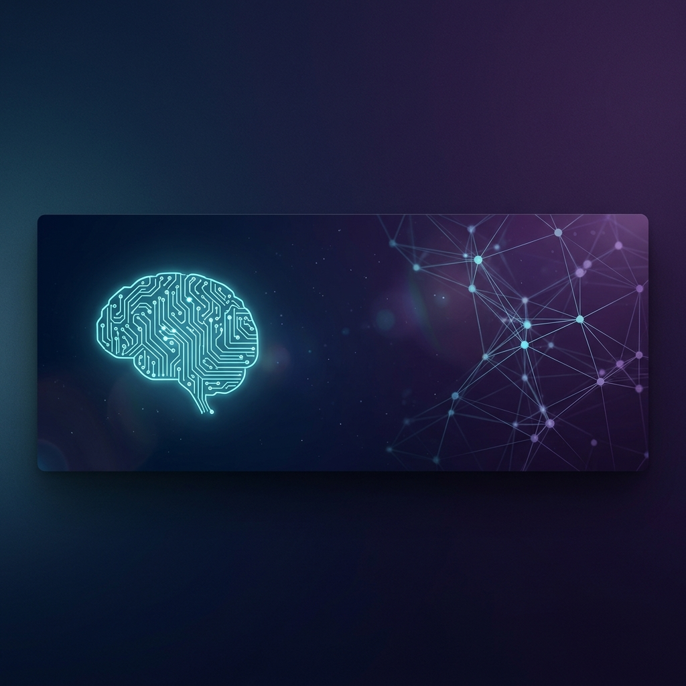
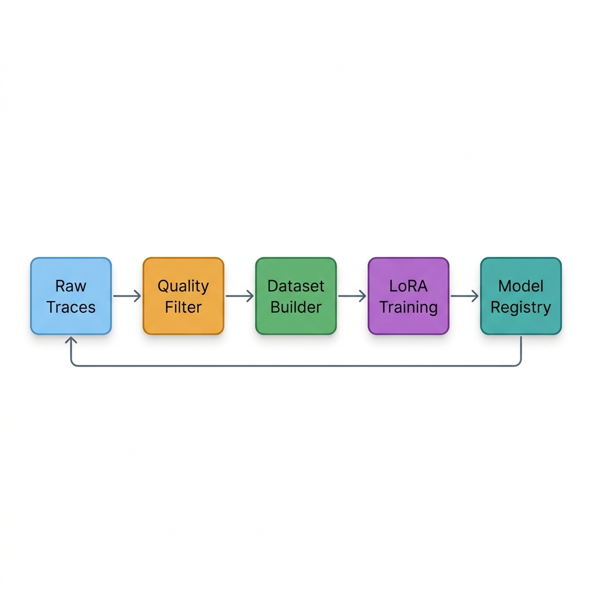
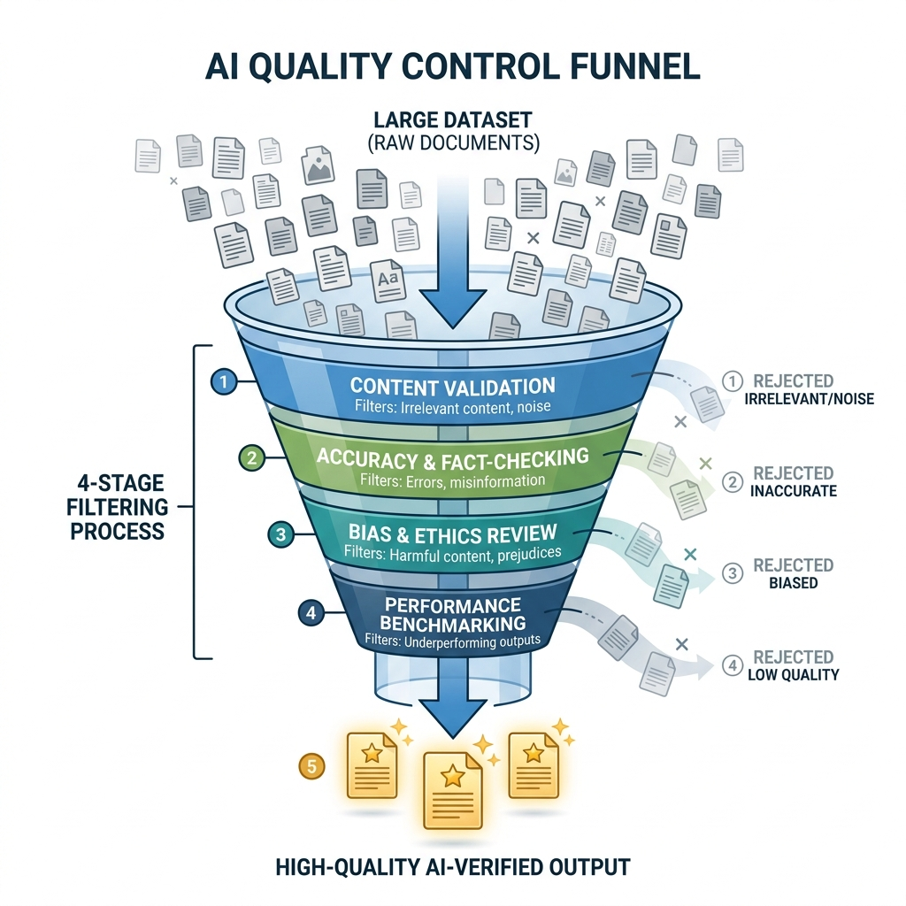

<p align="center">
  
</p>

<h1 align="center">Autonomous Cognitive System (ACS V3.1)</h1>

<p align="center">
  <em>A local-first, production-ready pipeline for autonomous RLHF and continuous AI self-improvement.</em>
</p>

<p align="center">
  
  
  
  
  
</p>

---

## Table of Contents

- [Why ACS?](#why-acs)
- [How It Works](#how-it-works)
- [Architecture Overview](#architecture-overview)
- [Project Structure](#project-structure)
- [Getting Started](#getting-started)
  - [Prerequisites](#prerequisites)
  - [Installation](#installation)
  - [Running Your First Query](#running-your-first-query)
- [The Evolution Loop](#the-evolution-loop)
  - [Phase 1 — Trace Generation](#phase-1--trace-generation)
  - [Phase 2 — Quality Filtering](#phase-2--quality-filtering)
  - [Phase 3 — Dataset Construction](#phase-3--dataset-construction)
  - [Phase 4 — Training & Promotion](#phase-4--training--promotion)
- [Quality Filter Deep Dive](#quality-filter-deep-dive)
- [Anti-Overfitting Measures](#anti-overfitting-measures)
- [CLI Reference](#cli-reference)
- [Configuration](#configuration)
- [Roadmap](#roadmap)
- [Contributing](#contributing)
- [License](#license)

---

## Why ACS?

Most LLMs hit a reasoning plateau after initial training. They learn to *repeat patterns* rather than *think structurally*. Improving them further traditionally requires:

1. Expensive human annotators to label thousands of preference pairs.
2. Cloud API access to frontier models for knowledge distillation.
3. Manual, engineer-intensive RLHF pipelines that break between iterations.

**ACS eliminates all three bottlenecks.** It creates a fully autonomous closed loop where a local model generates reasoning traces, critically evaluates its own outputs, filters for quality, and trains itself on the survivors — all without human intervention.

The result is an upward spiral: each training iteration produces a slightly smarter model, which then produces better traces, which produce better training data, which produces an even smarter model.

---

## How It Works

The system operates on a simple but powerful principle:

> **Generate → Evaluate → Filter → Train → Promote → Repeat**

1. The model receives complex questions and produces structured JSON reasoning traces (decomposition, step-by-step logic, self-critique, confidence scores).
2. An adversarial evaluator (the same model, with a different system prompt) ruthlessly grades each trace across 6 dimensions.
3. Only traces exceeding a hard mathematical floor (≥ 0.65 evaluator average) survive.
4. Surviving traces are augmented with anti-overfitting transformations (shuffling, noise injection, compression).
5. The augmented dataset trains a LoRA adapter on the local model.
6. The new model is benchmarked against the previous version. If it regresses, it is discarded.

---

## Architecture Overview

<p align="center">
  
</p>

The pipeline flows through five major stages in a continuous feedback loop. Each stage is implemented as an independent, testable Python module with clean interfaces between them.

---

## Project Structure

```
smart-llm/
├── acs.py                  # CLI entrypoint — routes all commands
├── core_acs.py             # Cognitive kernel — LLM interface, DEEP reasoning
├── executive.py            # Query router — classifies complexity
├── world_model.py          # Knowledge graph — SQLite + NetworkX memory
├── policy.py               # Adaptive thresholds — auto-tuning cognitive modes
│
├── quality_filter.py       # 4-stage quality gate (the "bouncer")
├── dataset_builder.py      # Anti-overfitting dataset construction
├── trace_collector.py      # Raw trace harvester
├── trainer.py              # LoRA fine-tuning engine (MLX)
├── model_registry.py       # Version control for model weights
├── evaluation_suite.py     # Tier 1 + Tier 2 regression benchmarks
├── evolve.py               # Evolution orchestrator — ties everything together
│
├── phase_b_builder.py      # Phase B dataset construction utilities
├── acs_mcp_server.py       # MCP server for IDE integration
├── generate_traces.py      # Automated background trace generator
├── test_world_model.py     # Unit tests for world model
│
├── docs/
│   └── images/             # Architecture diagrams and visuals
├── requirements.txt        # Python dependencies
├── run_acs.sh              # Quick-start shell script
└── README.md               # This file
```

---

## Getting Started

### Prerequisites

| Requirement | Details |
|---|---|
| **Python** | 3.10 or higher |
| **Local LLM Server** | [LM Studio](https://lmstudio.ai/), [Ollama](https://ollama.ai/), or [vLLM](https://github.com/vllm-project/vllm) serving on `http://localhost:1234/v1` |
| **Recommended Model** | Any instruction-tuned model ≥7B parameters (Qwen-2.5, Llama-3, Mistral) |
| **OS** | macOS (Apple Silicon recommended for MLX training) or Linux |
| **RAM** | 16GB minimum, 32GB recommended |

### Installation

```bash
# 1. Clone the repository
git clone git@github.com:mailtoharutyunyan/smart-llm.git
cd smart-llm

# 2. Create and activate virtual environment
python3 -m venv venv
source venv/bin/activate

# 3. Install dependencies
pip install -r requirements.txt

# 4. Verify your local LLM is responding
curl http://localhost:1234/v1/models
```

You should see a JSON response listing available models. If not, start your LLM server first.

### Running Your First Query

```bash
# Interactive multi-turn chat
python acs.py chat

# Single reasoning query (triggers DEEP mode automatically)
python acs.py think "What are the trade-offs between microservices and monoliths?"
```

When you run a `think` command, the system will:
1. Route the query through the Executive to determine complexity.
2. Activate DEEP mode (Best-of-3 inference-time scaling).
3. Generate 3 independent reasoning traces in parallel.
4. Select the highest-scoring trace.
5. Automatically save the trace for future training.

---

## The Evolution Loop

The evolution loop is the core innovation of ACS. It converts raw interactions into training data and continuously improves the model.

### Phase 1 — Trace Generation

Every time the system processes a DEEP query, it produces a structured JSON trace:

```json
{
  "decomposition": ["sub-task 1", "sub-task 2", "..."],
  "plan": "Step-by-step approach...",
  "steps": [
    {"step": 1, "thought": "...", "result": "..."},
    {"step": 2, "thought": "...", "result": "..."}
  ],
  "self_critique": "What I missed...",
  "verification": "How I checked my work...",
  "answer": "Final synthesized answer...",
  "confidence": 0.82,
  "gaps": ["Known limitation 1", "Known limitation 2"]
}
```

**Automated generation:** For hands-free data collection, run the background generator:
```bash
nohup python generate_traces.py > trace_gen.log 2>&1 &
```
This will continuously prompt the model with diverse, complex questions across multiple domains (mathematics, biology, physics, philosophy, technology, history).

### Phase 2 — Quality Filtering

<p align="center">
  
</p>

Every raw trace passes through a 4-stage quality gate before it can enter the training dataset. This is the most critical component — it prevents the model from training on its own mistakes.

**The four checks:**

| Check | What It Does | Failure Condition |
|---|---|---|
| **Ground Truth** | Validates math/code answers against known solutions | Wrong answer = instant reject |
| **Adversarial Evaluator** | Forces the LLM to grade itself with a harsh critic prompt | Average score < 0.65 = reject |
| **Novelty Decay** | Measures semantic distance from existing accepted traces | Too similar to existing data = reject |
| **Difficulty Calibration** | Prevents trivial questions from inflating the dataset | Below difficulty threshold = reject |

**Expected acceptance rate:** 15–30% of raw traces. If acceptance exceeds 50%, the filter is too lenient. If below 5%, the model needs improvement.

### Phase 3 — Dataset Construction

Accepted traces are not used as-is. The `DatasetBuilder` applies three anti-overfitting transformations:

1. **Dependency-Aware Shuffling** — Logically independent reasoning steps are reordered to prevent sequence memorization.
2. **Noise Injection** — 25% of traces receive a deliberately wrong step followed by a `[WAIT, CONTRADICTION FOUND]` correction, teaching the model error recovery.
3. **Centroid Compression** — Structurally identical traces are clustered and culled to prevent stylistic collapse.

Additionally, strict distribution caps are enforced:
- No single domain may exceed 20% of the dataset.
- Step-count distribution targets: 30% short, 50% medium, 20% long.

### Phase 4 — Training & Promotion

```bash
# Run the complete evolution pipeline
python acs.py evolve

# Or dry-run to verify without training
python acs.py evolve --dry-run
```

The orchestrator (`evolve.py`) executes:

1. **Pre-training baseline** — Benchmarks current model on Tier 1 (deterministic logic) and Tier 2 (open-ended reasoning).
2. **LoRA training** — Fine-tunes the model using the constructed dataset (rank=8, epochs=3).
3. **Post-training evaluation** — Re-runs benchmarks on the new model.
4. **Regression check** — If Tier 1 accuracy drops by more than 2%, the new weights are **automatically rejected**.
5. **Promotion** — If the new model passes, it becomes the active model in the registry.

---

## Quality Filter Deep Dive

The quality filter (`quality_filter.py`) is designed to be deliberately harsh. During the bootstrap phase (iteration 1), the evaluator floor is temporarily set to `0.60` to allow initial data collection. After the first successful training, it is restored to `0.65`.

**Why 0.65?** Through empirical testing, we found that traces scoring below 0.65 on the adversarial evaluator consistently contained:
- Unjustified logical leaps
- Missing verification steps  
- Over-confident conclusions unsupported by the reasoning chain
- Shallow decomposition that masks complexity

The evaluator grades across 6 dimensions:

| Dimension | Weight | What It Measures |
|---|---|---|
| `decomposition_quality` | High | How well the problem is broken into sub-tasks |
| `plan_coherence` | High | Logical flow between planned steps |
| `step_validity` | High | Whether each step follows from the previous |
| `self_awareness` | Medium | Quality of self-critique and gap identification |
| `conclusion_support` | High | Whether the final answer is supported by the chain |
| `confidence_calibration` | Medium | Whether stated confidence matches actual quality |

---

## Anti-Overfitting Measures

Training on synthetic data is dangerous. Without safeguards, models experience **"model collapse"** — they memorize surface patterns (tone, formatting, sentence structure) rather than learning deeper reasoning capabilities. ACS implements five countermeasures:

| Measure | Implementation | Purpose |
|---|---|---|
| **Structural Shuffling** | Topological sort of independent reasoning steps, then random reorder | Prevents sequence memorization |
| **Noise Injection** | Insert deliberate error + correction pairs in 25% of traces | Teaches error recovery |
| **Domain Balancing** | Hard cap of 20% per domain | Prevents topic bias |
| **Centroid Compression** | Cluster traces by structural signature, cull duplicates beyond threshold | Prevents stylistic collapse |
| **Eval/Train Split** | 10% of traces reserved for evaluation, never used in training | Enables honest regression detection |

---

## CLI Reference

### Core Commands

```bash
# Interactive chat session
python acs.py chat

# Single DEEP reasoning query
python acs.py think "Your question here"

# Run the full evolution pipeline
python acs.py evolve

# Dry-run evolution (no training, just validation)
python acs.py evolve --dry-run

# Skip filtering, use existing accepted traces
python acs.py evolve --skip-filter
```

### Inspection Commands

```bash
# View trace collection statistics
python acs.py traces --stats

# View acceptance rate and quality report
python acs.py traces --quality-report

# Check for evaluator drift over time
python acs.py traces --evaluator-drift

# Validate constructed datasets
python acs.py dataset --validate

# List all model versions in registry
python acs.py model --list
```

---

## Configuration

Key parameters can be adjusted in the source files:

| Parameter | File | Default | Description |
|---|---|---|---|
| `EVALUATOR_FLOOR` | `quality_filter.py` | 0.60 (bootstrap) / 0.65 | Minimum evaluator score to accept a trace |
| `DOMAIN_CAP` | `dataset_builder.py` | 0.20 | Maximum fraction of dataset from one domain |
| `QUALITY_THRESHOLD` | `quality_filter.py` | 0.70 | Overall weighted quality score threshold |
| `LLM_ENDPOINT` | `core_acs.py` | `localhost:1234` | Local model server address |
| `BEST_OF_N` | `core_acs.py` | 3 | Number of parallel traces in DEEP mode |

---

## Roadmap

- [x] Core reasoning engine with Best-of-N inference
- [x] Adversarial quality filtering with hard evaluator floor
- [x] Anti-overfitting dataset construction
- [x] Automated evolution orchestrator
- [x] Evaluator drift detection
- [x] MCP server integration
- [ ] Multi-GPU distributed training support
- [ ] Web dashboard for monitoring evolution metrics
- [ ] Cloud LLM integration for hybrid local/cloud pipelines
- [ ] Extended benchmark suite (MMLU, HumanEval, GSM8K)

---

## Contributing

Contributions are welcome. If you want to improve the system:

1. Fork the repository.
2. Create a feature branch (`git checkout -b feature/your-feature`).
3. Commit your changes with clear, descriptive messages.
4. Push to your fork and open a Pull Request.

Please ensure all existing tests pass before submitting.

---

## License

This project is licensed under the MIT License. See [LICENSE](LICENSE) for details.

---

<p align="center">
  <strong>Built for the future of offline autonomous reasoning.</strong><br/>
  <em>Designed and maintained by Arayik Harutyunyan</em>
</p>
